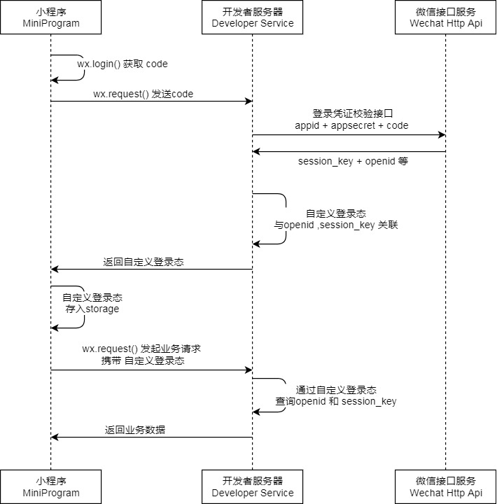

# mp-weixin-login
mp-weixin



## 使用 mp-weixin 结合 koa 实现小程序登录流程及 token 返回

#### 安装依赖
```shell
npm install
```

#### 启动服务
```shell
npm run serve
```

#### 路由访问
```text
http://localhost:9991/login/check
```
```text
http://localhost:9991/order/list
```
